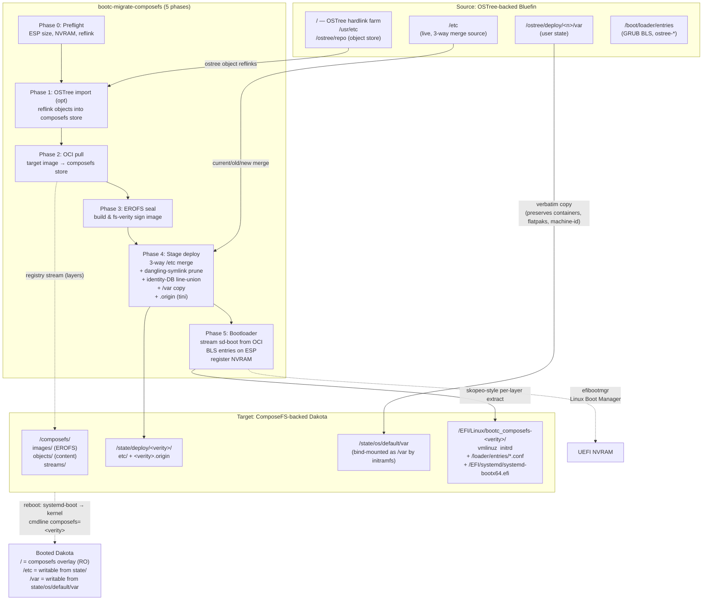

# bootc-migrate-composefs

In-place migration utility that converts an OSTree-backend bootc system
(e.g. Bluefin) into a ComposeFS-backend bootc system (e.g. Dakota), without
reinstalling and without losing `/home`, `/var`, `/etc` customizations,
flatpaks, container storage, or user accounts.

> **Status: experimental.** End-to-end on Bluefin → Dakota works through
> systemd-boot and a composefs root mount; the active workstream and current
> blockers are tracked in [HANDOFF.md](HANDOFF.md). Don't point this at a
> system you can't reinstall.

## Architecture



## What it does

Five phases, run as one command:

1. **Preflight** — free-space, reflink/CoW, UEFI, NVRAM-writable, ESP capacity.
2. **OSTree import** *(optional)* — reflinks existing OSTree file objects into
   the composefs object store so the pull in phase 2 is mostly dedup.
3. **OCI pull** — `bootc internals cfs oci pull` of the target bootc image.
4. **EROFS image** — builds and seals the composefs EROFS metadata image.
5. **Stage deploy** — 3-way `/etc` merge with identity-DB line-union,
   dangling `/usr/*` symlink pruning, `/var` data copy into
   `state/os/default/var` so user data appears under the bootc initramfs
   bind-mount, `.origin` (boot_digest, manifest_digest) written via tini.
6. **Bootloader** — installs systemd-boot on the ESP (extracted from the
   target image's OCI layers via direct registry streaming), writes BLS
   entries, registers `Linux Boot Manager` in UEFI NVRAM, keeps the existing
   OSTree GRUB entry as a fallback.

After a successful reboot into the composefs entry, `bootc-migrate-composefs
commit` removes the OSTree fallback and makes composefs permanent.

## Usage

```
sudo bootc-migrate-composefs \
  --target-image ghcr.io/projectbluefin/dakota:stable
```

Useful flags:

| Flag                | Purpose                                                            |
| ------------------- | ------------------------------------------------------------------ |
| `--dry-run`         | Print every action; touch nothing                                  |
| `--skip-import`     | Skip phase 1 (faster when target image is mostly new content)      |
| `--bootloader grub2` | Stay on GRUB2 instead of installing systemd-boot                  |
| `--skip-preflight`  | Bypass preflight checks (don't)                                   |
| `--force`           | Proceed past non-fatal warnings                                   |

```
sudo bootc-migrate-composefs commit
```

…run **after** rebooting into the composefs entry and confirming the system
is healthy. Cleans up the OSTree fallback boot entry.

## Requirements

- Booted on an OSTree-backed bootc system (Bluefin, Aurora, Silverblue…)
- UEFI firmware with writable NVRAM (for the systemd-boot path; GRUB2 fallback
  works on BIOS)
- Btrfs sysroot with reflink/CoW support (xfs tracked in
  [#16](https://github.com/hanthor/ostree-composefs-rebase/issues/16))
- ESP with ≥150 MB free
- ≥ `1.1 × ostree_repo_size` free on `/sysroot/composefs` (no reflink: 1.5×)

## Building

```
cargo build --release
```

Drops a single binary at `target/release/bootc-migrate-composefs`.

## End-to-end tests

A QEMU-based E2E harness lives in `tests/run-e2e.sh`. It installs Bluefin
into a disk image, runs the migration against a local registry mirror of the
Dakota target image, reboots, and validates the system came up on composefs.

```
sudo ./tests/run-e2e.sh
```

Overridable via env: `BASE_IMAGE`, `TARGET_IMAGE`, `DISK_SIZE`, `SKIP_SETUP`.

## Layout

- `src/main.rs` — CLI surface (clap)
- `src/preflight.rs` — environment validation
- `src/migration/mod.rs` — five-phase orchestrator
- `src/composefs.rs` — wraps `bootc internals cfs`
- `src/ostree.rs` — OSTree object scan + reflink import
- `src/mergetc.rs` — 3-way `/etc` merge
- `src/migration/bootloader.rs` — BLS entry generation
- `tests/run-e2e.sh` — QEMU E2E harness
- [SPECIFICATION.md](SPECIFICATION.md) — design doc
- [HANDOFF.md](HANDOFF.md) — current status, open issues, recent decisions

## License

TBD.
