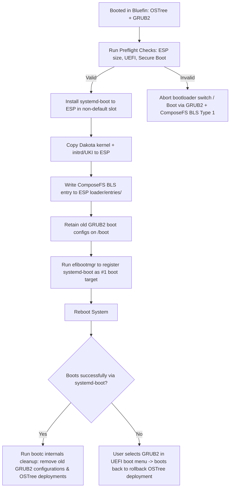

# OSTree → ComposeFS Rebase: Comprehensive Specification

**Status**: Draft  
**Date**: 2026-06-14  

---

## Table of Contents

1. [Executive Summary](#1-executive-summary)
2. [OSTree Backend: On-Disk Layout](#2-ostree-backend-on-disk-layout)
3. [ComposeFS Backend: On-Disk Layout](#3-composefs-backend-on-disk-layout)
4. [Boot Entry Management](#4-boot-entry-management)
5. [Comparison: OSTree vs ComposeFS Layouts](#5-comparison-ostree-vs-composefs-layouts)
6. [Migration Plan: OSTree → ComposeFS Rebase](#6-migration-plan-ostree--composefs-rebase)
7. [End-to-End Testing Rig](#7-end-to-end-testing-rig)
8. [Open Issues & Risks](#8-open-issues--risks)
9. [Source References](#9-source-references)

---

## 1. Executive Summary

Bootable containers (bootc) currently support two storage backends:

- **OSTree backend** (stable, default): Content-addressed versioned filesystem using OSTree. Container images are flattened and deployed as OSTree commits.
- **ComposeFS backend** (experimental): Uses composefs-rs to store container images natively as EROFS images with fsverity integrity.

The OSTree backend relies on `/ostree/repo/objects/` for content storage, `/ostree/deploy/<stateroot>/deploy/<checksum>/` for deployments, and BLS entries with `ostree=` kernel command-line arguments to locate the deployment root.

The ComposeFS backend stores content in `/sysroot/composefs/objects/` keyed by SHA-512, with EROFS boot images in `/sysroot/composefs/images/`, deployment state in `/sysroot/state/deploy/<sha512>/`, and uses `composefs=` kernel arguments. It supports both BLS Type 1 entries (with vmlinuz+initrd copied to `/boot`) and Type 2 UKIs.

A rebase from OSTree to ComposeFS means converting the on-disk layout and boot chain while preserving `/etc` and `/var` state. The bootc project acknowledges this as planned future work ("In place transitions: First support factory reset from ostree to composefs. Next: Support copying /etc and /var").

---

## 2. OSTree Backend: On-Disk Layout

### 2.1 Physical Filesystem Layout

```
/sysroot/                           # Physical root (mounted as read-only after boot)
├── ostree/
│   ├── repo/                       # OSTree repository (content-addressed)
│   │   ├── objects/                # SHA-256 hashed content objects
│   │   │   ├── xx/                 # First two hex chars of SHA-256
│   │   │   │   └── <checksum>.file  # Content files (bare mode)
│   │   │   │   └── <checksum>.dirtree  # Directory tree objects
│   │   │   │   └── <checksum>.dirmeta  # Directory metadata objects
│   │   │   │   └── <checksum>.commit  # Commit objects
│   │   │   └── ...
│   │   ├── refs/                   # Named refs (like Git branches)
│   │   │   ├── heads/
│   │   │   ├── remotes/
│   │   │   └── ostree/container/   # Container image refs
│   │   │       ├── blob/<sha256_digest>  # Per-layer blobs
│   │   │       └── image/<sha256_digest> # Flattened image commits
│   │   ├── config
│   │   ├── extensions/
│   │   └── state/
│   ├── deploy/
│   │   └── <stateroot>/            # Default: "default"
│   │       ├── deploy/
│   │       │   └── <checksum>.0/   # Deployment root (hardlinked checkout)
│   │       │       ├── etc -> ../../var/usr/etc  (or merged copy)
│   │       │       ├── usr/        # Operating system (/bin, /sbin → symlinks)
│   │       │       ├── opt/
│   │       │       └── ...         # Immutable filesystem tree
│   │       ├── var/                # Shared mutable /var (persists across deployments)
│   │       └── .origin             # Deployment origin ref (points to image)
│   └── bootc/
│       └── storage/                # bootc-owned containers-storage (LBI support)
├── boot/
│   ├── loader/
│   │   └── entries/                # BLS entry files (.conf)
│   │       ├── ostree-1-fedora.conf
│   │       ├── ostree-2-fedora.conf
│   │       └── ...
│   ├── grub2/
│   │   └── grub.cfg                # Auto-generated from BLS entries
│   ├── vmlinuz-*                   # Copied kernel (when no /usr/lib/modules layout)
│   └── initramfs-*.img             # Copied initramfs
├── usr/
│   └── lib/
│       ├── bootc/
│       │   └── storage -> ../../sysroot/ostree/bootc/storage
│       └── ostree/
│           └── prepare-root.conf   # ComposeFS configuration for ostree-prepare-root
```

### 2.2 Container Image Storage in OSTree

Container images go through a multi-step pipeline:

1. **Pull**: The OCI image layers (tarballs) are fetched by skopeo via `containers-image-proxy-rs`.
2. **Layer Import**: Each layer tarball is imported as an OSTree commit under `ostree/container/blob/<sha256_digest>`.
3. **Flatten**: Layers are merged into a flattened filesystem tree and committed under `ostree/container/image/<sha256_digest>`.
4. **Deploy**: The flattened commit is checked out via hardlinks into `/ostree/deploy/<stateroot>/deploy/<checksum>.0/`.
5. **ComposeFS (optional)**: If `/usr/lib/ostree/prepare-root.conf` has `[composefs]\nenabled = yes`, a composefs image is generated alongside the hardlinked checkout. This is the **OSTree-with-composefs** mode (not the native composefs backend).

### 2.3 Boot Chain (OSTree Backend)

```
Firmware → shim → GRUB → kernel → initramfs → ostree-prepare-root.service
                                                      │
                                                      ├─ Read ostree= karg
                                                      ├─ Find deployment in /ostree/deploy/
                                                      ├─ Bind-mount /sysroot → deployment root
                                                      ├─ Mount composefs (if enabled)
                                                      └─ pivot_root / switch_root
```

The `ostree=` kernel argument has the format:
```
ostree=/ostree/boot.N/<stateroot>/<bootcsum>/<bootserial>
```

### 2.4 BLS Entry Format (OSTree)

Example `/boot/loader/entries/ostree-1-fedora.conf`:
```ini
title Fedora Linux 41
version 6.8.0
linux /ostree/fedora-abc123/vmlinuz-6.8.0
initrd /ostree/fedora-abc123/initramfs-6.8.0.img
options root=UUID=aaaa-bbbb rw ostree=/ostree/boot.1/fedora/abc123/0
```

---

## 3. ComposeFS Backend: On-Disk Layout

### 3.1 Physical Filesystem Layout (Native ComposeFS)

```
/sysroot/                           # Physical root
├── composefs/                      # ComposeFS repository (mode 0700)
│   ├── objects/                    # SHA-512 content-addressed objects
│   │   ├── xx/                     # First two hex chars of SHA-512
│   │   │   └── <sha512_hash>       # Content-object files
│   │   └── ...
│   ├── images/                     # Bootable EROFS images
│   │   └── <sha512_hash>.erofs     # Each image is an EROFS filesystem
│   ├── splits/                     # OCI split-stream layer data
│   │   └── <sha256_digest>/        # Per-layer split streams
│   │       ├── <layer_digest>.oci  # Layer metadata
│   │       └── ...
│   ├── refs/                       # Named references (tags)
│   │   └── localhost/
│   │       └── bootc-sha256:<manifest_digest>  # GC root tags
│   ├── manifests/                  # OCI manifest splitstreams
│   │   └── <sha256_digest>
│   ├── configs/                    # OCI config splitstreams
│   │   └── <sha256_digest>
│   └── bootc/                      # bootc-owned containers-storage (unified storage)
│       └── storage/                # overlay driver containers-storage
├── state/
│   ├── deploy/                     # Per-deployment mutable state
│   │   └── <sha512_verity>/        # Deployment ID = SHA-512 fsverity digest
│   │       ├── etc/                # 3-way merged /etc (copy-on-deploy)
│   │       ├── var -> ../../os/default/var  # Symlink to shared /var
│   │       ├── <sha512_verity>.origin     # INI-format origin file
│   │       └── <sha512_verity>.imginfo    # OCI image config JSON (for status and labels)
│   └── os/
│       └── default/
│           └── var/                # Shared persistent /var
├── ostree/
│   └── bootc -> ../composefs/bootc  # Compatibility symlink
├── boot/
│   ├── loader/
│   │   ├── entries/                # Active BLS entries
│   │   │   ├── bootc_fedora-41.20251125-1.conf  # Primary
│   │   │   └── bootc_fedora-41.20251124-0.conf  # Secondary/rollback
│   │   └── entries.staged/         # Staged entries (pending reboot)
│   ├── grub2/
│   │   ├── user.cfg                # Active grub menu entries
│   │   ├── user.cfg.staged         # Staged grub menu entries
│   │   └── efiuuid.cfg             # ESP filesystem UUID for grub
│   └── bootc_composefs-<sha512>/   # Copied vmlinuz + initrd (BLS Type1)
│       ├── vmlinuz
│       └── initrd
├── EFI/                            # ESP mount (if systemd-boot)
│   ├── Linux/
│   │   ├── bootc/                  # bootc-controlled UKI directory
│   │   │   ├── bootc_composefs-<sha512>.efi   # UKI binary
│   │   │   ├── bootc_composefs-<sha512>.efi.extra.d/  # UKI addons dir
│   │   │   └── ...
│   │   └── bootc_composefs-<sha512>/  # Copied vmlinuz + initrd (sysd Type1)
│   │       ├── vmlinuz
│   │       └── initrd
│   └── loader/
│       ├── loader.conf             # systemd-boot config (timeout)
│       ├── entries/                # Active BLS entries for systemd-boot
│       └── entries.staged/         # Staged BLS entries
```

### 3.2 Container Image Storage in ComposeFS

The ComposeFS backend has two pull paths:

#### Direct Pull (default)
```
OCI Registry → skopeo → composefs_oci::pull → composefs objects/
```
The image is pulled directly via skopeo into the composefs object store. Each file in the image is stored as a SHA-512 content-addressed object with optional fsverity.

#### Unified Pull (with containers-storage)
```
OCI Registry → podman API → containers-storage (overlay)
                            → composefs_oci::pull (ZeroCopy/FICLONE)
                            → composefs objects/
```
The image is first pulled into bootc-owned containers-storage (so podman can use it), then imported into composefs via FICLONE reflinks for zero-copy.

### 3.3 Origin File Format (ComposeFS Backend)

Example `<sha512_verity>.origin`:
```ini
[origin]
container-image-reference = ostree-unverified-image:docker://quay.io/fedora/fedora-bootc:41

[boot]
boot_type = bls
digest = a1b2c3d4e5f6...
```

#### 3.3.1 Image Info File Format (ComposeFS Backend)

Alongside the origin file, the deployment directory contains a `<sha512_verity>.imginfo` file. This contains the full OCI image configuration JSON, which is essential for `bootc status` to report the image digest, creation timestamp, architecture, and container labels.

Example snippet from `<sha512_verity>.imginfo`:
```json
{
  "config": {
    "created": "2026-06-12T06:39:24Z",
    "architecture": "amd64",
    "os": "linux",
    "config": {
      "Env": ["PATH=/usr/local/sbin:/usr/local/bin:/usr/sbin:/usr/bin:/sbin:/bin"],
      "Labels": {
        "containers.bootc": "1",
        "ostree.bootable": "1"
      }
    }
  }
}
```

### 3.4 Boot Chain (ComposeFS Backend)

#### BLS Type 1 (vmlinuz + initrd copied to /boot)
```
Firmware → shim/GRUB → kernel → initramfs → systemd
  │                                              │
  ├─ Kernel copied from /boot/bootc_composefs-<sha512>/vmlinuz
  ├─ Initrd copied from /boot/bootc_composefs-<sha512>/initrd
  └─ cmdline: root=... composefs=<sha512_verity>
                 │
                 └─ kernel initramfs mounts composefs EROFS image as root
```

#### UKI Type 2 (Unified Kernel Image)
```
Firmware → systemd-boot (signed) → UKI (signed PE binary)
  │                                   │
  ├─ .linux section: kernel          ├─ cmdline: composefs=<sha512_verity>
  ├─ .initrd section: initramfs      ├─ .osrel section: /etc/os-release
  └─ Signed with Secure Boot key     └─ .sbat, .pcrsig, etc.
```

### 3.5 EROFS Image Format (On-Disk)

The ComposeFS EROFS image used for boot is an EROFS-backed composefs image with a custom header:

```c
struct lcfs_erofs_header_s {
    uint32_t magic;              // 0xd078629a ("composefs" EROFS variant)
    uint32_t version;            // LCFS_EROFS_VERSION = 1
    uint32_t flags;              // LCFS_EROFS_FLAGS_HAS_ACL = (1 << 0)
    uint32_t composefs_version;  // LCFS_VERSION_MAX = 1
    uint32_t unused[4];
};
```

The image is mounted via `composefs=digest` on the kernel command line, validated by fsverity if configured.

---

## 4. Boot Entry Management

### 4.1 Bootloader Support Matrix

| Bootloader   | OSTree Backend | ComposeFS BLS (Type1) | ComposeFS UKI (Type2) |
|-------------|:---:|:---:|:---:|
| GRUB2       | ✓ (via bootupd) | ✓ | ✓ (via menuentry in grub2/user.cfg) |
| systemd-boot | ✗ | ✓ | ✓ (primary) |
| zipl (s390x) | ✓ | ✗ | ✗ |
| none        | ✓ | ✗ | ✗ |

### 4.2 BLS Type 1 Entry Format (ComposeFS)

Example `/boot/loader/entries/bootc_fedora-41.20251125.0-1.conf`:
```ini
title Fedora Linux 41.20251125.0
version 41.20251125.0
linux /bootc_composefs-abc123/vmlinuz
initrd /bootc_composefs-abc123/initrd
options root=UUID=aaaa-bbbb rw composefs=abc123
sort-key bootc-fedora-0
```

#### Naming Convention for Grub Compatibility

Grub parses BLS filenames using RPM-style `split_package_string()`:
```
Format: bootc_{os_id}-{version}-{priority}.conf

Grub parses:
- name:  bootc_{os_id}     (hyphens in os_id → underscores)
- version: {version}
- release: {priority}       (DESCENDING sort)

Example:
  bootc_fedora-41.20251125.0-1.conf  → primary (release=1)
  bootc_fedora-41.20251125.0-0.conf  → secondary (release=0)
```

#### Sort Keys for systemd-boot

```
primary:   bootc-{os_id}-0   (lower = sorted first by systemd-boot)
secondary: bootc-{os_id}-1
```

### 4.3 Boot Entry Lifecycle

#### Staged Deployment Pattern

Both backends use a "staged" deployment pattern for upgrades:

1. **Pull**: New image is pulled into storage
2. **Stage**: Boot entries written to `entries.staged/` (not `entries/`)
3. **Finalize** (at shutdown/reboot):
   a. 3-way `/etc` merge runs
   b. `entries.staged/` is atomically renamed to `entries/`
   c. Old boot entries are garbage collected
   d. Bootloader config is regenerated (grub.cfg or systemd-boot)

This is orchestrated by `bootc-finalize-staged.service` on ComposeFS and `ostree-finalize-staged.service` on OSTree.

### 4.4 Kernel + Initrd Management

#### OSTree Backend

Kernel and initrd are located in the deployment directory under:
- `/usr/lib/modules/<kver>/vmlinuz` (modern)
- `/boot/vmlinuz-<kver>` (legacy)

The "boot checksum" is a SHA-256 hash of (vmlinuz + initrd + devicetree) contents, pre-computed at commit time.

#### ComposeFS Backend

Kernel and initrd are discovered from `/usr/lib/modules/<kver>/` in the EROFS image. They are copied to a directory named `bootc_composefs-<hash>/` under `/boot` (Grub) or `EFI/Linux/` (systemd-boot).

Multiple deployments sharing the same kernel+initrd will share the same boot binary directory (detected by the SHA-256 `bootDigest` of the kernel+initrd).

> [!NOTE]
> **Directory Naming Note**: The directory `bootc_composefs-<hash>` on the ESP or `/boot` partition is named after the composefs verity digest of the *first* deployment that introduced that specific combination of kernel and initrd. If subsequent deployments share the same kernel and initrd, they will reuse this directory without renaming it, meaning the hash in the directory name will not necessarily match the composefs verity digest of the currently booted deployment.

---

## 5. Comparison: OSTree vs ComposeFS Layouts

| Aspect | OSTree | ComposeFS |
|--------|--------|-----------|
| **Root mount type** | Hardlinked checkout + optional overlayfs/composefs | composefs EROFS image (always) |
| **Content addressing** | SHA-256 (ostree bare repo) | SHA-512 (fsverity-digest objects) |
| **Immutable root** | Via chattr +i + composefs overlay (optional) | Always: EROFS is read-only by design |
| **Deployment path** | `/ostree/deploy/<stateroot>/deploy/<cksum>.0/` | `/sysroot/state/deploy/<sha512>/` |
| **Shared /var** | `/ostree/deploy/<stateroot>/var` | `/state/os/default/var` |
| **Boot entry** | `ostree-{n}-{name}.conf` in `loader/entries/` | `bootc_{os_id}-{version}-{prio}.conf` |
| **Kernel arg** | `ostree=/ostree/boot.N/stateroot/bootcsum/serial` | `composefs=<sha512>` |
| **Boot kernel** | From deployment dir | Copied to `/boot/` or ESP |
| **Integrity** | Optional: composefs verity overlay on OSTree objects | Native: fsverity on composefs objects |
| **UKI support** | No | Yes (primary feature) |
| **Bootloader install** | bootupd (GRUB + shim) | systemd-boot or bootupd |
| **Staging path** | `ostree admin upgrade --stage` | `bootc upgrade` → entries.staged |

---

## 6. Migration Plan: OSTree → ComposeFS Rebase

### 6.1 Migration Strategy Overview

The bootc project roadmap outlines two phases:

1. **Phase 1: Factory reset** — Blow away existing OSTree state and install fresh as ComposeFS (losing `/etc` and `/var` customizations). Tracked in [bootc#404](https://github.com/bootc-dev/bootc/issues/404).

2. **Phase 2: State-preserving migration** — Convert the OSTree backend to ComposeFS while preserving `/etc` and `/var`. This is the ultimate goal.

### 6.2 Phase 1: Factory Reset Migration

The simplest approach — `bootc install` to the same disk with ComposeFS backend:

```bash
# 1. Verify current system is OSTree-bootc
bootc status
# Should show: "Booted: ostree"

# 2. Pull target image (same or newer version)
bootc switch --transport docker://quay.io/fedora/fedora-bootc:41

# 3. Reinstall with composefs backend
# (hypothetical command; exact API TBD)
bootc install to-filesystem --composefs-backend /dev/sdaX

# OR: perform in-place conversion
bootc internals migrate-to-composefs
```

**What happens under the hood:**
1. Preserve `/etc` and `/var` contents to a temporary location
2. Wipe `/sysroot/ostree/` (or the entire root filesystem)
3. Initialize composefs repository at `/sysroot/composefs/`
4. Pull the current (or specified) container image into composefs repo
5. Generate EROFS boot image
6. Create deployment state directory `/sysroot/state/deploy/<sha512>/`
7. Restore `/etc` and `/var` into the new state directory
8. Copy kernel+initrd to `/boot/bootc_composefs-<sha512>/`
9. Write BLS entry with `composefs=` kernel argument
10. Update bootloader configuration
11. Reboot

**Risk**: Loss of rollback history — the old OSTree deployments are destroyed.

### 6.3 Phase 2: State-Preserving Migration

This is the more sophisticated approach that preserves the system state while switching the backend.

#### Step 1: Assessment & Validation

```bash
# Check system state
bootc status --json
# Need to know:
# - Current booted deployment checksum
# - Current /etc and /var state
# - /etc diff (what's been customized vs defaults)
# - All existing deployments (for rollback preservation)

# Check composefs prerequisites
# - Kernel supports CONFIG_EROFS_FS
# - Filesystem supports reflinks (FICLONE) for efficient copy
# - Enough free space for composefs objects (roughly same size as ostree repo)
bootc internals preflight-composefs
```

#### Step 2: Boot into Transition Deployment

The system must not be running from the OSTree deployment being converted. Options:

1. **Soft reboot**: Use `systemctl soft-reboot` to boot a minimal initramfs-based transition environment (composefs soft_reboot.rs already implements this for the ComposeFS backend).

2. **Staged conversion**: Create a new composefs deployment alongside the OSTree one, write boot entries for both, and reboot into composefs.

#### Step 3: Filesystem Layout Conversion

The critical difference is the conversion of filesystem content from OSTree format to ComposeFS format:

```
┌─────────────────────────────────────────────────────┐
│  OSTree Backend                     ComposeFS       │
│                                                      │
│  /ostree/repo/objects/XX/XXXX.XXX  ──→ objects/XX/  │
│  /ostree/deploy/default/           ──→ state/deploy/ │
│  /ostree/deploy/default/var        ──→ state/os/default/var │
│  /boot/loader/entries/ostree-*.conf──→ bootc_*.conf  │
│  /boot/vmlinuz-*                   ──→ bootc_composefs-*/│
│  ostree= kernel arg                ──→ composefs=    │
└─────────────────────────────────────────────────────┘
```

The conversion process:

```
1. Create target directories:
   mkdir -p /sysroot/composefs/objects
   mkdir -p /sysroot/state/deploy
   mkdir -p /sysroot/state/os/default/var

2. Convert ostree objects to composefs objects:
   For each object in /ostree/repo/objects/:
     - Read the ostree file object
     - Compute SHA-512 content digest (raw bytes, NOT including ostree metadata header)
     - FICLONE into /sysroot/composefs/objects/XX/<sha512>
     - Optionally enable fsverity on the new object

3. Create the composefs EROFS image:
   mkcomposefs --from-file /sysroot/composefs/objects/ <target_dir>
   Or use composefs-rs API: generate_boot_image()

4. Copy mutable state:
   cp -a /ostree/deploy/default/var /sysroot/state/os/default/var
   cp -a /etc (current merge) to /sysroot/state/deploy/<sha512>/etc
   # Extract the OCI configuration JSON from the OSTree commit metadata of the current deployment
   # (key: bootc.container-config or ostree.container-config) and write it to:
   # /sysroot/state/deploy/<sha512>/<sha512>.imginfo

5. Create deployment state:
   Write origin file referencing the same container image
   Create var -> ../../os/default/var symlink

6. Copy boot artifacts:
   Extract vmlinuz + initrd from current deployment
   Write to /boot/bootc_composefs-<sha512>/

7. Write BLS entries:
   Primary:  /boot/loader/entries/bootc_fedora-<ver>-1.conf
   Secondary: /boot/loader/entries/bootc_fedora-<ver>-0.conf
   (Secondary points to previous/rollback deployment)

8. Clean up (post-boot confirmation only):
   # DO NOT delete /sysroot/ostree/deploy/ during layout conversion.
   # Retaining /sysroot/ostree/deploy/ is critical to support the dual-boot transition period.
   # Once booted into ComposeFS and verified, a final cleanup command (e.g. bootc internals cleanup)
   # can safely remove /sysroot/ostree/deploy/ and /sysroot/ostree/repo/ to reclaim space.
```

#### Step 4: Dual-Boot Transition Period

During transition, maintain both backends:

- Current boot: ComposeFS deployment (new)
- Rollback: OSTree deployment (old, still accessible if conversion fails)

This requires writing BLS entries for both backends:
```ini
# Primary - new composefs entry
title Fedora Linux 41 (composefs)
...
options composefs=abc123...

# Secondary - old ostree entry for rollback
title Fedora Linux 41 (ostree)
...
options ostree=/ostree/boot.1/fedora/...
```

#### Step 5: Verify and Commit

After successful boot into ComposeFS:
1. Verify `bootc status` shows composefs backend
2. Verify `/etc` and `/var` state is intact (compare with pre-migration state)
3. Run `bootc internals composefs-gc` to clean up orphaned objects
4. Optionally remove the OSTree repo (`/sysroot/ostree/repo/`) to reclaim space

### 6.4 ComposeFS Backend: Dedup + Integrity Path

When [unified storage](https://github.com/bootc-dev/bootc/issues/20) goals are realized, the migration can leverage the three-store model:

```
containers-storage → composefs (FICLONE) → ostree commit (for rollback compat)
```

In this model, a composefs-to-ostree bridge would allow:
1. Convert existing ostree objects into composefs objects (FICLONE)
2. Synthesize ostree commits that reference composefs objects
3. Maintain backwards-compatible rollback to ostree deployments

### 6.5 Migration Constraints

| Constraint | Impact |
|-----------|--------|
| Disk space | Need ~2x current deployment size for transition period |
| Bootloader | Must switch from bootupd to systemd-boot (or update grub config) |
| Kernel args | `ostree=` must become `composefs=` |
| /etc merge state | Three-way merge context (old default, current, new default) must be reconstructed |
| /var | Simply copied — no merge needed (var is opaque) |
| SELinux | Labels may need recomputation for composefs objects |
| Secure Boot | If using Secure Boot + UKI, requires signing infrastructure |
| Rollback | OSTree rollback deployments may be lost unless explicitly preserved |

### 6.6 Implementation Entry Points in bootc Source

Key source files for implementing migration:

| File | Purpose |
|------|---------|
| `crates/lib/src/bootc_composefs/repo.rs` | ComposeFS repo init/pull logic |
| `crates/lib/src/bootc_composefs/state.rs` | Deployment state creation (write_composefs_state) |
| `crates/lib/src/bootc_composefs/boot.rs` | Boot entry setup (setup_composefs_bls_boot, setup_composefs_uki_boot) |
| `crates/lib/src/bootc_composefs/backwards_compat/` | Legacy OSTree→ComposeFS transition compatibility |
| `crates/lib/src/bootc_composefs/finalize.rs` | Staged deployment finalization (3-way /etc merge) |
| `crates/lib/src/bootc_composefs/gc.rs` | Garbage collection for composefs deployments |
| `crates/lib/src/store/mod.rs` | Storage abstraction (both backends) |
| `crates/lib/src/deploy.rs` | OSTree deployment lifecycle |
| `crates/lib/src/install.rs` | `bootc install` logic |
| `crates/lib/src/loader_entries.rs` | BLS entry parsing and kargs management |
| `crates/lib/src/composefs_consts.rs` | All composefs path/name constants |
| `crates/ostree-ext/src/` | OCI-to-ostree import/export |
| `/tmp/composefs-rs-research/crates/composefs-oci/src/` | OCI image → composefs conversion |

### 6.7 Bootloader Migration (GRUB2 → systemd-boot)

A core requirement for migrating from `projectbluefin/bluefin` to `projectbluefin/dakota` is transitioning the system's bootloader from GRUB2 to `systemd-boot` in-place on a running system. This is a complex transition with significant pitfalls.

#### 6.7.1 Detailed Preflight Verification
Before modifying the boot configuration or EFI System Partition (ESP), the migration tool must execute the following validation checks:

1. **ESP Size Validation**:
   - **Constraint**: `systemd-boot` loads kernels, initramfs files, and Unified Kernel Images (UKIs) directly from the ESP (FAT32 partition). In contrast, GRUB2 loads them from the `/boot` partition (typically ext4/xfs).
   - **Requirement**: The ESP must have enough space to store at least two versions of the kernel/initrd (active + fallback) for safety. For a typical `bootc` image, this requires at least **300MB of free space** on the ESP (ideally 500MB+ total ESP size).
   - **Action**: Check free space on the ESP (mounted under `/boot/efi` or `/efi`). If the ESP has less than 300MB of free space, **abort the bootloader transition** and default to GRUB2 + ComposeFS BLS Type 1, which keeps kernel/initrd files on the `/boot` partition.

2. **UEFI Boot Mode & NVRAM Access**:
   - **Constraint**: `systemd-boot` requires a UEFI firmware environment and the ability to register UEFI boot variables.
   - **Action**: Verify `/sys/firmware/efi/efivars` is populated and writable. If booted in Legacy BIOS mode (CSM) or if the NVRAM is read-only, abort the `systemd-boot` migration.

3. **Secure Boot & Key Enrollment**:
   - **Constraint**: Enabling Secure Boot requires the `systemd-boot` binary and the loaded UKI/kernel to be signed with keys trusted by the firmware (e.g., the Microsoft UEFI CA or enrolled Machine Owner Keys (MOK)).
   - **Action**: Check Secure Boot status via `mokutil --sb-state` or efivars. If active, verify the target image provides signed binaries compatible with the system's firmware or that a local MOK signing infrastructure is available.

#### 6.7.2 Step-by-Step Transition Workflow (Dual-Bootloader Staging)
To prevent bricking the system in case of bootloader failure, the switch is staged using a dual-bootloader configuration:



1. **Stage systemd-boot Binaries**:
   - Install `systemd-boot` to the ESP using `bootctl install --no-variables`. This copies `systemd-bootx64.efi` to the ESP without changing UEFI NVRAM boot order, leaving GRUB2 as the default for the moment.

2. **Copy Boot Files to ESP**:
   - Extract the kernel and initrd (or UKI) from the Dakota container image and copy them to the ESP:
     - For BLS Type 1: `/EFI/Linux/bootc_composefs-<hash>/vmlinuz` and `initrd`.
     - For UKI Type 2: `/EFI/Linux/boot/bootc_composefs-<hash>.efi`.

3. **Create systemd-boot BLS Entry**:
   - Write a new BLS entry to the systemd-boot loader entries directory on the ESP (e.g., `/boot/efi/loader/entries/bootc_bluefin_dakota-<ver>-1.conf`) pointing to the newly copied files.

4. **Maintain GRUB2 Staging (Rollback Path)**:
   - Do **NOT** modify or delete existing GRUB2 entries or files on the `/boot` partition.
   - This ensures that if the system fails to boot via `systemd-boot`, the user can press the UEFI boot menu key (F12/F11) at startup and select the GRUB2 entry to boot the old working OSTree deployment.

5. **Update UEFI NVRAM Boot Order**:
   - Run `efibootmgr` to register systemd-boot as the primary boot choice (first option) and demote the GRUB2 bootloader to the secondary option.

6. **Verify and Clean Up**:
   - Reboot the system.
   - Upon successful boot into Dakota via `systemd-boot`, verify that `bootc status` shows ComposeFS and systemd-boot.
   - Run the final cleanup command which removes the old GRUB2 boot records and `/sysroot/ostree/` deployments to reclaim storage space.

#### 6.7.3 Btrfs Subvolume Migration Details
Since both Bluefin and Dakota use Btrfs as the default filesystem, subvolume structure must be carefully transitioned:

1. **OSTree Subvolume Layout**:
   - OSTree typically uses a subvolume (e.g., `root`) representing the deployment tree, and `/var` is either a subdirectory or a separate subvolume.
2. **ComposeFS Subvolume Layout**:
   - ComposeFS expects the physical root of the partition (subvolume ID 5, `/`) to be mounted under `/sysroot`.
   - The active `/var` must reside at `/sysroot/state/os/default/var`.
3. **Migration Steps**:
   - If `/var` is a separate subvolume (e.g., `var` subvolume in Btrfs):
     - Retain the subvolume. Update `/etc/fstab` (or systemd mount units) in the ComposeFS state directory (`/sysroot/state/deploy/<sha512>/etc/fstab`) to mount the existing `var` subvolume to `/var` (or `/sysroot/state/os/default/var`), preserving user home directories (symlinked under `/var/home`) and containers data.
   - If `/var` is a subdirectory within the `root` subvolume:
     - Move the contents of `/var` to `/sysroot/state/os/default/var` (instantaneous rename operation on Btrfs since it is on the same physical partition).

---

## 7. End-to-End Testing Rig

### 7.1 Design Goals

1. Run in GitHub CI (Ubuntu runners with KVM support or self-hosted runners)
2. Test the full OSTree → ComposeFS migration cycle
3. Verify state preservation (`/etc` customizations, `/var` data)
4. Test both BLS Type 1 and UKI Type 2 boot
5. Test with both GRUB and systemd-boot bootloaders
6. Support both factory-reset and state-preserving migration paths
7. Run within reasonable CI time limits (~30 minutes)

### 7.2 Test Infrastructure Options

#### Option A: libvirt + VMs (Recommended)

```
GitHub CI Runner (ubuntu-24.04, KVM-enabled)
  └── libvirt/qemu VM
       ├── UEFI firmware (OVMF) with Secure Boot (optional)
       ├── GPT-partitioned raw disk image
       │    ├── /boot (or ESP for systemd-boot)
       │    └── / (btrfs or xfs with reflink support)
       └── OSTree-bootc installation as starting state
```

#### Option B: nspawn containers with composefs mount support

Lightweight approach using systemd-nspawn that can mount composefs images:
- Faster startup
- No VM overhead
- But: no UEFI/bootloader testing (only validates storage migration)

#### Option C: bootc's own test infrastructure

bootc already has integration tests (`crates/tests-integration/src/`) using:
- Custom VM runner (`runvm.rs`)
- OSTree install testing (`install.rs`)
- Container export/import testing (`container.rs`)

These could be extended to test composefs migration.

### 7.3 Recommended Test Architecture: Hybrid

```
Layer 1: Unit tests (fast, no VM)
  ├── test_migrate_origin_conversion     # Origin file format conversion
  ├── test_migrate_bls_entry_conversion  # BLS entry rewrite
  ├── test_migrate_etc_merge             # /etc 3-way merge after migration
  └── test_migrate_identity              # Filesystem tree comparison

Layer 2: Storage-level integration tests (VM)
  ├── test_full_migration_cycle          # Full OSTree → ComposeFS migration
  ├── test_migration_rollback            # Migration failure rollback
  ├── test_migration_state_preservation  # Verify /etc and /var preserved
  └── test_migration_to_uki              # Migration + UKI generation

Layer 3: End-to-end boot tests (VM)
  ├── test_migration_boot_bls_grub       # Boot via GRUB after migration
  ├── test_migration_boot_bls_systemd    # Boot via systemd-boot after migration
  ├── test_migration_boot_uki            # Boot via UKI after migration
  └── test_migration_upgrade_cycle       # Upgrade after migration
```

### 7.4 Test Setup Script (Layer 2/3 VM)

```bash
#!/bin/bash
# test-ostree-to-composefs-migration.sh
# Runs inside a VM with a pre-installed OSTree-bootc system

set -euo pipefail

# --- Phase 0: Setup ---
IMAGE="quay.io/fedora/fedora-bootc:41"
DISK="/dev/vda"
ROOT_PART="${DISK}2"

# Verify starting state
bootc status | grep -q "Booted: ostree" || { echo "FAIL: Not OSTree-booted"; exit 1; }

# Create test files to verify preservation
echo "migration-test-data" > /etc/migration-test-config
echo "persistent-data" > /var/lib/migration-test-data

# Record state for comparison
PRE_MIG_ETC_HASH=$(find /etc -type f -exec sha256sum {} \; | sort | sha256sum)
PRE_MIG_VAR_CONTENT=$(cat /var/lib/migration-test-data)

# Discover kernel and initrd paths
KVERSION=$(ls /usr/lib/modules | head -1)
PRE_MIG_VMLINUZ="/usr/lib/modules/${KVERSION}/vmlinuz"
PRE_MIG_INITRD="/usr/lib/modules/${KVERSION}/initramfs.img"

# --- Phase 1: Perform Migration ---
echo "=== Starting migration ==="

# Pull the same image into composefs format
bootc container pull --composefs-backend $IMAGE

# Generate composefs objects from OSTree repository
# (hypothetical command — actual API TBD)
bootc internals migrate-to-composefs \
    --preserve-etc \
    --preserve-var \
    --bootloader=auto

# Verify new composefs state
bootc status | grep -q "Booted: composefs" || echo "WARNING: Still showing OSTree"

# Write BLS entries for both backends (dual-boot transition)
# Primary: composefs
# Secondary: ostree (rollback safety)

# --- Phase 2: Reboot into ComposeFS ---
echo "=== Rebooting into composefs deployment ==="
# systemctl soft-reboot  # if using soft-reboot path
# OR: trigger normal reboot with new BLS entry as default

# --- Phase 3: Post-Reboot Verification ---
# (runs after reboot)

# Verify booted backend
bootc status | grep -q "Booted: composefs" || { echo "FAIL: Not composefs-booted after migration"; exit 1; }

# Verify state preservation
test -f /etc/migration-test-config || { echo "FAIL: /etc/migration-test-config missing"; exit 1; }
test "$(cat /etc/migration-test-config)" = "migration-test-data" || { echo "FAIL: /etc content changed"; exit 1; }
test "$(cat /var/lib/migration-test-data)" = "persistent-data" || { echo "FAIL: /var content changed"; exit 1; }

POST_MIG_ETC_HASH=$(find /etc -type f -exec sha256sum {} \; | sort | sha256sum)
test "$PRE_MIG_ETC_HASH" = "$POST_MIG_ETC_HASH" || {
    echo "WARNING: /etc hash changed (may be expected due to 3-way merge)"
    # Compare detailed diff
    diff <(echo "$PRE_MIG_ETC_HASH") <(echo "$POST_MIG_ETC_HASH") || true
}

# Verify on-disk layout
test -d /sysroot/composefs/objects || { echo "FAIL: No composefs objects"; exit 1; }
test -d /sysroot/composefs/images || { echo "FAIL: No composefs images"; exit 1; }
test -d /sysroot/state/deploy || { echo "FAIL: No state deploy dir"; exit 1; }

# Old OSTree deployment should still exist (rollback safety)
test -d /sysroot/ostree/deploy || echo "WARNING: OSTree deployments removed"

# Verify rollback BLS entry exists
ls /boot/loader/entries/ostree-*.conf 2>/dev/null && echo "OK: OSTree rollback entry present"

# --- Phase 4: Upgrade Test (migrated system) ---
echo "=== Testing upgrade on migrated system ==="

# Perform an upgrade to verify the composefs upgrade path works
bootc upgrade

# Verify staged deployment
ls /boot/loader/entries.staged/ || echo "WARNING: No staged entries"

# Reboot into upgraded deployment
# ... reboot ...
bootc status | grep -q "Booted: composefs" || { echo "FAIL: Not composefs-booted after upgrade"; exit 1; }

echo "=== Migration test PASSED ==="
```

### 7.5 GitHub Actions Workflow

```yaml
name: Migration Tests (OSTree → ComposeFS)

on:
  push:
    branches: [main]
  pull_request:
    branches: [main]
  workflow_dispatch:

jobs:
  # --- Layer 1: Fast unit tests ---
  unit-tests:
    runs-on: ubuntu-24.04
    steps:
      - uses: actions/checkout@v4
      - uses: dtolnay/rust-toolchain@stable
      - run: cargo test --lib migration

  # --- Layer 2: Storage migration tests (VM) ---
  storage-migration:
    needs: unit-tests
    runs-on: [self-hosted, linux, kvm]  # or ubuntu-24.04 if KVM available
    timeout-minutes: 30
    strategy:
      matrix:
        fs: [xfs, btrfs]
        bootloader: [grub, systemd-boot]
    steps:
      - uses: actions/checkout@v4
      
      - name: Build bootc with composefs support
        run: |
          cargo build --release --features composefs
      
      - name: Prepare test VM disk image
        run: |
          # Create a raw disk image with GPT partitions
          truncate -s 20G /tmp/test-disk.raw
          
          # Partition: ESP (512M) + root (rest)
          sgdisk -Z /tmp/test-disk.raw
          sgdisk -n 1:0:+512M -t 1:ef00 /tmp/test-disk.raw
          sgdisk -n 2:0:0 -t 2:8304 /tmp/test-disk.raw
          
          # Format
          LOOP=$(losetup --show -f -P /tmp/test-disk.raw)
          mkfs.vfat -F32 ${LOOP}p1
          mkfs.${{ matrix.fs }} -f ${LOOP}p2
          losetup -d $LOOP
      
      - name: Install OSTree-bootc system in VM
        run: |
          # Use virt-install or qemu to boot installer ISO
          # Install Fedora bootc in OSTree mode
          virt-install \
            --name migration-test \
            --ram 4096 \
            --vcpus 2 \
            --disk /tmp/test-disk.raw \
            --os-variant fedora-eln \
            --boot uefi \
            --network none \
            --nographics \
            --location https://dl.fedoraproject.org/pub/fedora/linux/releases/41/Everything/x86_64/os/ \
            --extra-args "inst.ks=https://example.com/kickstart-bootc-ostree.cfg console=ttyS0"
      
      - name: Run migration test script
        run: |
          virsh start migration-test
          virsh console migration-test --force < ./test-ostree-to-composefs-migration.sh
          virsh destroy migration-test
      
      - name: Validate filesystem layout
        run: |
          # Mount the VM disk and verify layout
          LOOP=$(losetup --show -f -P /tmp/test-disk.raw)
          mount ${LOOP}p2 /mnt/test-root
          
          # Verify composefs layout exists
          test -d /mnt/test-root/composefs/objects
          test -d /mnt/test-root/composefs/images
          test -d /mnt/test-root/state/deploy
          
          # Verify OSTree cleanup
          ! test -d /mnt/test-root/ostree/repo/objects || echo "OSTree objects still present"
          
          umount /mnt/test-root
          losetup -d $LOOP
  
  # --- Layer 3: End-to-end boot tests ---
  boot-tests:
    needs: storage-migration
    runs-on: [self-hosted, linux, kvm]
    timeout-minutes: 45
    strategy:
      matrix:
        scenario:
          - boot-type: bls
            bootloader: grub
          - boot-type: bls
            bootloader: systemd-boot
          - boot-type: uki
            bootloader: systemd-boot
    steps:
      - uses: actions/checkout@v4
      
      - name: Run boot test
        run: |
          # Similar VM setup but with UEFI + Secure Boot for UKI
          # After migration, verify actual boot into composefs
          # Check bootc status output
          # Check filesystem integrity with fsverity
      
      - name: Test rollback
        run: |
          # Force migration failure scenario
          # Verify system rolls back to OSTree deployment
          # Check that bootc status shows "Booted: ostree"
```

### 7.6 Key Test Scenarios

| Scenario | Description | Expected Result |
|----------|-------------|-----------------|
| **Happy path** | OSTree → ComposeFS migration with state preservation | ComposeFS boot, /etc intact, /var intact |
| **No space** | Migration when disk is nearly full | Clean error, OSTree system unaffected |
| **Power loss mid-migration** | Simulate crash during migration | Rollback to OSTree on next boot |
| **Corrupted composefs image** | Corrupt an object after migration | fsverity detects corruption, boot fails gracefully |
| **Custom /etc** | Migration with heavily customized /etc | All customizations preserved through 3-way merge |
| **Large /var** | Migration with multi-GB /var | /var fully preserved, no data loss |
| **Multiple deployments** | Migration of system with 3+ OSTree deployments | Rollback deployments optionally preserved |
| **UKI generation** | Migration + UKI creation for sealed image | UKI boots with composefs= signature verification |
| **Upgrade after migration** | Normal bootc upgrade on migrated system | Staged deployment, atomic finalization works |
| **Rollback after migration** | Roll back from composefs to ostree (dual-boot) | System boots OSTree deployment |
| **Grub → systemd-boot** | Bootloader change during migration | systemd-boot loads UKI or BLS entry |
| **XFS vs btrfs** | Migration on different filesystems | FICLONE works on both, behaviour identical |

### 7.7 Validation Test Case: Bluefin to Dakota Migration

To validate the storage migration and bootloader switch under real-world conditions, a specific test case must be executed that targets the migration from a `projectbluefin/bluefin:stable` image to a `projectbluefin/dakota:stable` image.

#### 7.7.1 Validation Starting State
- **Image**: `ghcr.io/projectbluefin/bluefin:stable` (OSTree-bootc format).
- **Bootloader**: GRUB2 + shim (Secure Boot active).
- **Filesystem**: Btrfs with a dedicated subvolume layout:
  - Top-level subvolume (subvolid=5, `/`) mounted as `/sysroot` (or read-only physical root).
  - Subvolume `root` containing the active OSTree deployment.
  - Subvolume `var` containing persistent user data and home directories (symlinked under `/var/home`).
- **ESP size**: Statically configured to simulate old installations (test matrix must cover 100MB and 500MB sizes).

#### 7.7.2 Validation Workflow Steps
1. **Preflight Stage**:
   - Run the preflight checks. Ensure the tool correctly identifies if the ESP has `< 300MB` of free space, and:
     - On the `100MB` ESP VM: Verify the tool **aborts** the `systemd-boot` migration, keeps GRUB2, and boots Dakota using GRUB2 + ComposeFS BLS Type 1.
     - On the `500MB` ESP VM: Verify the tool proceeds with the `systemd-boot` migration.
   - Verify that Btrfs subvolumes are correctly discovered.

2. **Migration Stage**:
   - Execute `bootc internals migrate-to-composefs --target-image=ghcr.io/projectbluefin/dakota:stable`.
   - Verify that all OSTree bare objects are successfully imported as ComposeFS SHA-512 objects. If reflinking is supported (Btrfs), verify that the disk block usage does **not** double (using `du --reflink` or filesystem queries).
   - Verify that Btrfs subvolume layout is preserved:
     - The existing `var` subvolume is updated in `/etc/fstab` to mount at `/sysroot/state/os/default/var`.
     - The `/var/home` and `/home` contents are preserved intact.

3. **Bootloader Setup Stage**:
   - Install `systemd-boot` to ESP in staging mode (leaving GRUB2 default).
   - Write systemd-boot configuration and Dakota BLS entries to `/loader/entries/`.
   - Register systemd-boot in UEFI NVRAM via `efibootmgr` as the first boot target.

4. **Reboot and First Boot Stage**:
   - Trigger a reboot.
   - Verify that systemd-boot starts successfully, reads the Dakota BLS entry, mounts the ComposeFS EROFS image as the root filesystem, and successfully bind-mounts the `var` subvolume.
   - Verify that Secure Boot chain validation passes (meaning `systemd-boot` and the UKI/kernel are signed with keys trusted by the shim/OVMF firmware).

5. **Rollback Staging Verification**:
   - Manually trigger a boot failure (e.g. by passing invalid kernel arguments to systemd-boot or corrupting the Dakota EROFS image).
   - Verify that the UEFI firmware automatically falls back to the GRUB2 boot option, or the user can select GRUB2 in the boot menu.
   - Verify that GRUB2 successfully boots the rollback `projectbluefin/bluefin` OSTree deployment and mounts the original `/var` subvolume correctly.

---

## 8. Open Issues & Risks

### 8.1 Risks

| Risk | Severity | Mitigation |
|------|----------|------------|
| `/etc` merge may lose customizations if the 3-way merge algorithm behaves differently between ostree-finalize and composefs-finalize | High | Exhaustive comparison testing; verify /etc diff before and after |
| Kernel+initrd compatibility (composefs requires EROFS + overlayfs kernel config) | High | Pre-flight check before migration |
| Secure Boot chain: switching from shim+GRUB to systemd-boot+UKI breaks existing Secure Boot chain | High | Support dual-bootloader config; offer GRUB2-only migration path to prevent Secure Boot breakage on systems without systemd-boot support. |
| Disk space exhaustion during copy: on filesystems without reflink (FICLONE) support (e.g. ext4), copying objects doubles storage usage | High | Verify reflink support and ensure free space is > 1.5x active deployment size before starting. |
| Rollback destruction via premature cleanup: deleting `/sysroot/ostree/deploy/` during migration renders OSTree boot entries unbootable immediately | High | Retain OSTree deployment directories during the transition period; defer removal until post-boot verification is complete. |
| SELinux Labeling: incorrect label application in the EROFS metadata image or on objects can lead to boot-time policy blocks and failures | High | Preserve and pass all security contexts (including `security.selinux` xattrs) from the OSTree repo to `mkcomposefs` / `composefs-rs`. |
| GRUB2 path resolution failure: `grub2-mkconfig` fails to resolve the canonical path under composefs/overlay fs layouts | Medium | Ensure `grub2` and `bootupd` are upgraded to versions that include composefs path resolution fixes prior to migration. |
| Grub BLS filename parsing: need to carefully format bootc BLS filenames for correct ordering | Low | Already handled in boot.rs (type1_entry_conf_file_name) |

### 8.2 Known Gaps (from bootc docs/issue tracker)

1. **[Garbage collection](https://github.com/bootc-dev/bootc/pull/2040)**: In progress
2. **[Extended install APIs](https://github.com/bootc-dev/bootc/issues/522)**: Needed for clean %post and osbuild mutations
3. **[OCI registry install](https://github.com/bootc-dev/bootc/issues/1703)**: can fail due to config mismatch
4. **[composefs-rs repository finalization](https://github.com/bootc-dev/bootc/issues/1320)**
5. **[Sealed image build UX](https://github.com/bootc-dev/bootc/issues/1498)**: Streamlined UKI building
6. **[Factory reset from ostree to composefs](https://github.com/bootc-dev/bootc/issues/404)**: First step of in-place transitions
7. **Upgrade image in sealed cases**: Test suite doesn't cover this well yet
8. **Workflow upgrades "from old systems"**: Not yet tested

### 8.3 Decision Points

1. **Dual-boot transition period**: How long should both backends coexist? One reboot? Until explicitly cleaned?
2. **Rollback policy**: Do we keep ostree deployments as rollback targets or discard them?
3. **Bootloader migration**: Force switch to systemd-boot, or maintain GRUB support?
4. **UKI requirement**: Is UKI mandatory for the ComposeFS backend, or is BLS Type 1 sufficient?
5. **Unified storage**: Should migration also enable unified storage (containers-storage sharing)?

---

## 9. Source References

> **Snapshots**: All source links below are pinned to the exact commits used during research, captured **2026-06-14**. Click through to any file at the pinned commit to fact-check a claim.
>
> bootc: [`85ad2f9a`](https://github.com/bootc-dev/bootc/commit/85ad2f9a39e4fe52bbb5ec6d87661f62b8a25468) · composefs (C): [`298edd6d`](https://github.com/containers/composefs/commit/298edd6de47be362632daac3b2c9c8eb53c9545b) · composefs-rs: [`3097f6e5`](https://github.com/containers/composefs-rs/commit/3097f6e5f83eb767e9c0853c3b359c5f9152cddf) · OSTree: [`0a348dd1`](https://github.com/ostreedev/ostree/commit/0a348dd1e2c380c6c35ab04c530746e2f49071da)

### Primary Sources

| Source | Permalink | Relevance |
|--------|-----------|-----------|
| bootc composefs module | [`crates/lib/src/bootc_composefs/mod.rs`](https://github.com/bootc-dev/bootc/blob/85ad2f9a/crates/lib/src/bootc_composefs/mod.rs) | Composefs backend implementation |
| bootc composefs repo | [`crates/lib/src/bootc_composefs/repo.rs`](https://github.com/bootc-dev/bootc/blob/85ad2f9a/crates/lib/src/bootc_composefs/repo.rs) | Pull, init, tag, OCI import |
| bootc composefs state | [`crates/lib/src/bootc_composefs/state.rs`](https://github.com/bootc-dev/bootc/blob/85ad2f9a/crates/lib/src/bootc_composefs/state.rs) | Deployment state creation |
| bootc composefs boot | [`crates/lib/src/bootc_composefs/boot.rs`](https://github.com/bootc-dev/bootc/blob/85ad2f9a/crates/lib/src/bootc_composefs/boot.rs) | Boot entry setup (BLS + UKI) |
| bootc composefs finalize | [`crates/lib/src/bootc_composefs/finalize.rs`](https://github.com/bootc-dev/bootc/blob/85ad2f9a/crates/lib/src/bootc_composefs/finalize.rs) | /etc merge + staged finalization |
| bootc composefs GC | [`crates/lib/src/bootc_composefs/gc.rs`](https://github.com/bootc-dev/bootc/blob/85ad2f9a/crates/lib/src/bootc_composefs/gc.rs) | Garbage collection |
| bootc composefs backwards compat | [`crates/lib/src/bootc_composefs/backwards_compat/`](https://github.com/bootc-dev/bootc/tree/85ad2f9a/crates/lib/src/bootc_composefs/backwards_compat) | Legacy migration (unprefixed → prefixed) |
| bootc store module | [`crates/lib/src/store/mod.rs`](https://github.com/bootc-dev/bootc/blob/85ad2f9a/crates/lib/src/store/mod.rs) | Dual-backend Storage type |
| bootc composefs consts | [`crates/lib/src/composefs_consts.rs`](https://github.com/bootc-dev/bootc/blob/85ad2f9a/crates/lib/src/composefs_consts.rs) | All path/name constants |
| bootc docs: composefs backend | [`experimental-composefs.md`](https://github.com/bootc-dev/bootc/blob/85ad2f9a/docs/src/experimental-composefs.md) | Sealed images, UKI, boot flow |
| bootc docs: filesystem layout | [`filesystem.md`](https://github.com/bootc-dev/bootc/blob/85ad2f9a/docs/src/filesystem.md) | Physical vs logical root, /etc, /var |
| bootc docs: sysroot | [`filesystem-sysroot.md`](https://github.com/bootc-dev/bootc/blob/85ad2f9a/docs/src/filesystem-sysroot.md) | /sysroot mount, stateroot |
| bootc docs: container storage | [`filesystem-storage.md`](https://github.com/bootc-dev/bootc/blob/85ad2f9a/docs/src/filesystem-storage.md) | OCI-to-ostree pipeline |
| bootc docs: unified storage | [`experimental-unified-storage.md`](https://github.com/bootc-dev/bootc/blob/85ad2f9a/docs/src/experimental-unified-storage.md) | Three-store model |
| bootc docs: bootloaders | [`bootloaders.md`](https://github.com/bootc-dev/bootc/blob/85ad2f9a/docs/src/bootloaders.md) | Bootloader support matrix |
| bootc docs: internals | [`internals.md`](https://github.com/bootc-dev/bootc/blob/85ad2f9a/docs/src/internals.md) | Code architecture |
| bootc docs: installation | [`installation.md`](https://github.com/bootc-dev/bootc/blob/85ad2f9a/docs/src/installation.md) | Install flow |
| composefs-rs: repository | [`composefs/src/repository.rs`](https://github.com/containers/composefs-rs/blob/3097f6e5/crates/composefs/src/repository.rs) | Core repo management |
| composefs-rs: OCI lib | [`composefs-oci/src/lib.rs`](https://github.com/containers/composefs-rs/blob/3097f6e5/crates/composefs-oci/src/lib.rs) | Pull, tag, GC, boot image |
| composefs-rs: OCI image | [`composefs-oci/src/image.rs`](https://github.com/containers/composefs-rs/blob/3097f6e5/crates/composefs-oci/src/image.rs) | OCI image → composefs filesystem |
| composefs-rs: bootloader | [`composefs-boot/src/bootloader.rs`](https://github.com/containers/composefs-rs/blob/3097f6e5/crates/composefs-boot/src/bootloader.rs) | Boot entry discovery |
| composefs-rs: UKI | [`composefs-boot/src/uki.rs`](https://github.com/containers/composefs-rs/blob/3097f6e5/crates/composefs-boot/src/uki.rs) | UKI section extraction |
| composefs (C): EROFS header | [`lcfs-erofs.h`](https://github.com/containers/composefs/blob/298edd6d/libcomposefs/lcfs-erofs.h) | EROFS superblock/header format |
| composefs (C): writer API | [`lcfs-writer.h`](https://github.com/containers/composefs/blob/298edd6d/libcomposefs/lcfs-writer.h) | Digest computation options |
| composefs (C): mount tool | [`mountcomposefs.c`](https://github.com/containers/composefs/blob/298edd6d/tools/mountcomposefs.c) | composefs mount helper |
| composefs (C): mkcomposefs | [`mkcomposefs.c`](https://github.com/containers/composefs/blob/298edd6d/tools/mkcomposefs.c) | composefs image builder |
| OSTree: deployment model | [`deployment.md`](https://github.com/ostreedev/ostree/blob/0a348dd1/docs/deployment.md) | Deployments, stateroot, BLS |
| OSTree: composefs integration | [`composefs.md`](https://github.com/ostreedev/ostree/blob/0a348dd1/docs/composefs.md) | OSTree's composefs overlay |
| OSTree: repo anatomy | [`repo.md`](https://github.com/ostreedev/ostree/blob/0a348dd1/docs/repo.md) | Object types, content addressing |
| OSTree: prepare-root manpage | [`ostree-prepare-root.xml`](https://github.com/ostreedev/ostree/blob/0a348dd1/man/ostree-prepare-root.xml) | Initramfs root preparation |
| bootc: loader entries | [`loader_entries.rs`](https://github.com/bootc-dev/bootc/blob/85ad2f9a/crates/lib/src/loader_entries.rs) | BLS kargs, source tracking |
| bootc: deploy module | [`deploy.rs`](https://github.com/bootc-dev/bootc/blob/85ad2f9a/crates/lib/src/deploy.rs) | OSTree deployment lifecycle |
| bootc: install module | [`install.rs`](https://github.com/bootc-dev/bootc/blob/85ad2f9a/crates/lib/src/install.rs) | bootc install logic |

### External References

| Resource | URL |
|----------|-----|
| bootc project | https://github.com/bootc-dev/bootc |
| composefs (C) | https://github.com/containers/composefs |
| composefs-rs | https://github.com/containers/composefs-rs |
| OSTree | https://github.com/ostreedev/ostree |
| bootupd | https://github.com/coreos/bootupd |
| BLS Specification | https://uapi-group.org/specifications/specs/boot_loader_specification/ |
| UKI Specification | https://uapi-group.org/specifications/specs/unified_kernel_image/ |
| bootc#404 (factory reset) | https://github.com/bootc-dev/bootc/issues/404 |
| bootc#20 (unified storage) | https://github.com/bootc-dev/bootc/issues/20 |
| bootc#1190 (composefs-native backend) | https://github.com/bootc-dev/bootc/issues/1190 |
| bootc#522 (install APIs) | https://github.com/bootc-dev/bootc/issues/522 |
| bootc#1498 (sealed image UX) | https://github.com/bootc-dev/bootc/issues/1498 |
| ostree#2867 (composefs integration) | https://github.com/ostreedev/ostree/issues/2867 |

### Key Source Files for Further Investigation

All links below are pinned to the research snapshots listed above.

**bootc composefs backend** (commit [`85ad2f9a`](https://github.com/bootc-dev/bootc/commit/85ad2f9a))

| File | Permalink |
|------|-----------|
| `repo.rs` — Pull, init, tag | [`crates/lib/src/bootc_composefs/repo.rs`](https://github.com/bootc-dev/bootc/blob/85ad2f9a/crates/lib/src/bootc_composefs/repo.rs) |
| `state.rs` — Deployment state creation | [`crates/lib/src/bootc_composefs/state.rs`](https://github.com/bootc-dev/bootc/blob/85ad2f9a/crates/lib/src/bootc_composefs/state.rs) |
| `boot.rs` — Boot entry creation | [`crates/lib/src/bootc_composefs/boot.rs`](https://github.com/bootc-dev/bootc/blob/85ad2f9a/crates/lib/src/bootc_composefs/boot.rs) |
| `finalize.rs` — /etc merge + finalization | [`crates/lib/src/bootc_composefs/finalize.rs`](https://github.com/bootc-dev/bootc/blob/85ad2f9a/crates/lib/src/bootc_composefs/finalize.rs) |
| `gc.rs` — Garbage collection | [`crates/lib/src/bootc_composefs/gc.rs`](https://github.com/bootc-dev/bootc/blob/85ad2f9a/crates/lib/src/bootc_composefs/gc.rs) |
| `backwards_compat/` — Legacy migration | [`crates/lib/src/bootc_composefs/backwards_compat/`](https://github.com/bootc-dev/bootc/tree/85ad2f9a/crates/lib/src/bootc_composefs/backwards_compat) |
| `update.rs` — Upgrade flow | [`crates/lib/src/bootc_composefs/update.rs`](https://github.com/bootc-dev/bootc/blob/85ad2f9a/crates/lib/src/bootc_composefs/update.rs) |
| `switch.rs` — Image switch | [`crates/lib/src/bootc_composefs/switch.rs`](https://github.com/bootc-dev/bootc/blob/85ad2f9a/crates/lib/src/bootc_composefs/switch.rs) |
| `status.rs` — Status reporting | [`crates/lib/src/bootc_composefs/status.rs`](https://github.com/bootc-dev/bootc/blob/85ad2f9a/crates/lib/src/bootc_composefs/status.rs) |
| `rollback.rs` — Rollback logic | [`crates/lib/src/bootc_composefs/rollback.rs`](https://github.com/bootc-dev/bootc/blob/85ad2f9a/crates/lib/src/bootc_composefs/rollback.rs) |
| `store/mod.rs` — Storage abstraction | [`crates/lib/src/store/mod.rs`](https://github.com/bootc-dev/bootc/blob/85ad2f9a/crates/lib/src/store/mod.rs) |
| `composefs_consts.rs` — Constants | [`crates/lib/src/composefs_consts.rs`](https://github.com/bootc-dev/bootc/blob/85ad2f9a/crates/lib/src/composefs_consts.rs) |
| `loader_entries.rs` — BLS entry management | [`crates/lib/src/loader_entries.rs`](https://github.com/bootc-dev/bootc/blob/85ad2f9a/crates/lib/src/loader_entries.rs) |
| `deploy.rs` — OSTree deployment | [`crates/lib/src/deploy.rs`](https://github.com/bootc-dev/bootc/blob/85ad2f9a/crates/lib/src/deploy.rs) |
| `install.rs` — Install flow | [`crates/lib/src/install.rs`](https://github.com/bootc-dev/bootc/blob/85ad2f9a/crates/lib/src/install.rs) |

**composefs-rs** (commit [`3097f6e5`](https://github.com/containers/composefs-rs/commit/3097f6e5))

| File | Permalink |
|------|-----------|
| `repository.rs` — Core repo management | [`composefs/src/repository.rs`](https://github.com/containers/composefs-rs/blob/3097f6e5/crates/composefs/src/repository.rs) |
| `erofs/` — EROFS image creation | [`composefs/src/erofs/`](https://github.com/containers/composefs-rs/tree/3097f6e5/crates/composefs/src/erofs) |
| `lib.rs` (oci) — OCI pull, tag, boot image | [`composefs-oci/src/lib.rs`](https://github.com/containers/composefs-rs/blob/3097f6e5/crates/composefs-oci/src/lib.rs) |
| `image.rs` — Filesystem construction | [`composefs-oci/src/image.rs`](https://github.com/containers/composefs-rs/blob/3097f6e5/crates/composefs-oci/src/image.rs) |
| `boot.rs` (oci) — Boot image generation | [`composefs-oci/src/boot.rs`](https://github.com/containers/composefs-rs/blob/3097f6e5/crates/composefs-oci/src/boot.rs) |
| `bootloader.rs` — Boot entry discovery | [`composefs-boot/src/bootloader.rs`](https://github.com/containers/composefs-rs/blob/3097f6e5/crates/composefs-boot/src/bootloader.rs) |
| `uki.rs` — UKI handling | [`composefs-boot/src/uki.rs`](https://github.com/containers/composefs-rs/blob/3097f6e5/crates/composefs-boot/src/uki.rs) |

---

*This document was compiled from the source code of bootc, composefs, composefs-rs, and OSTree as of commit snapshots taken 2026-06-14.*
